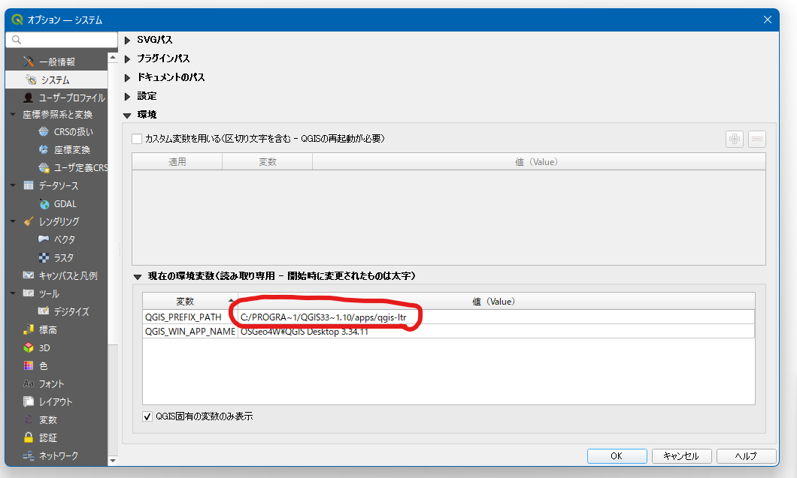
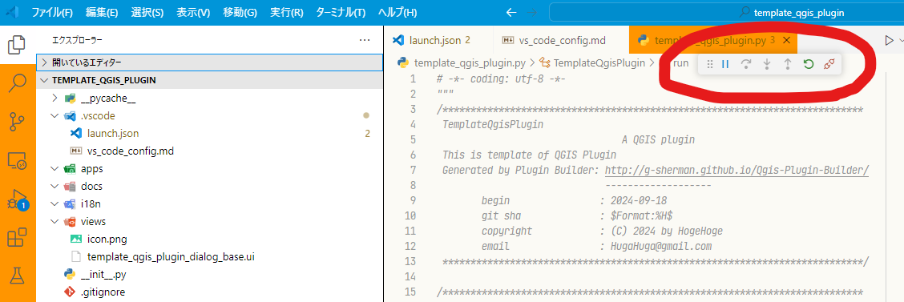
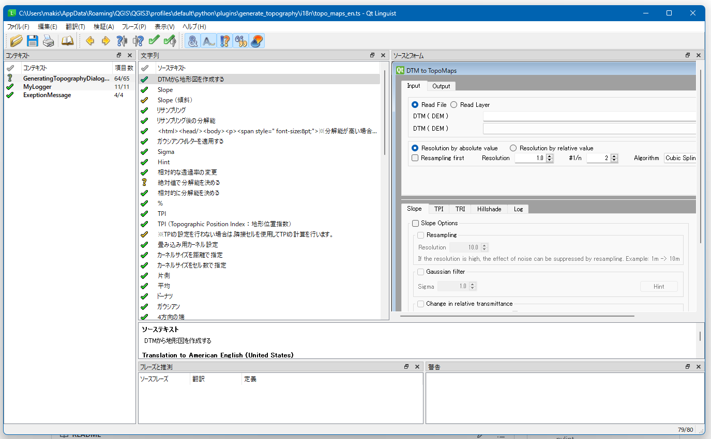

# **First step...**

## **アイコンファイルのコンパイル**

### 1. **アイコンファイルの作成**

自分でわかりやすいアイコンを適当に作成。

<br>

### 2. **ファイルの配置**

現在の設定では "./views/icon.png" としているので、同ディレクトリに "icon.png" として配置する。

場所を変えたい場合は "xxx_daialog.py" と "resources.py"、"metadata.txt" 内に書かれているパスを書き換える。

<br>

### 3. **コンパイル**
OSGeo4W Shell などの `pyrcc5` コマンドが使用可能なターミナルで、このプラグインディレクトリーに移動し、以下のコマンドを実行する。

```
>>> pyrcc5 -o resources.py resources.qrc
```

<br>

### 4. **リロード**
QGIS の `Plugin Reloader` でプラグインをリロードすればアイコンが変化する。

<br><br>

## **QtDesigner でダイアログをデザインする**

### 1. **QtDesigner を立ち上げる**

OSGeo4W Shell にて以下のコマンドを入力し、QtDesigner を立ち上げる。

```
>>> designer
```

<br>

### 2. **自由に編集する**

デザインの Tips は別途作成している。

<br><br>

## **コード補完**
プラグイン開発でコード補完を効かせる為に `settings.json` 内の `python.analysis.extraPaths` を書き換える。

赤字の部分と青字の部分は環境によって違うので、自分の環境を確認する。

例）"C:\\PROGRA~1\\<span style="color: red; font-weight: bold;">QGIS33~1.10</span>\\apps\\<span style="color: blue; font-weight: bold;">qgis-ltr</span>\\python"

### 1. **赤字の部分を確認する**



<br>

### 2. **qgis or qgis-ltr**

long term release をインストールした場合は `qgis-ltr` そうでない場合は `qgis` のはず...

<br><br>

## **デバッグ**

`.vscode` 内に保存している `launch.json` でデバッグ設定を行っている。

デバッグを行う場合は以下の手順で行う。

### 1. **QGIS を開く**

<br>

### 2. **script 内の任意の位置にブレークポイントを置く**

<br>

### 3. **vs code で `F5` キーを押してデバッグを開始する**
    
画像内赤丸のようにツールが現れたら成功。



<br>

### 4. **QGIS でプラグインを起動してデバッグを行う**


> 参考URL: https://gist.github.com/giohappy/8a30f14678aa7e446f9b694c632d7089

<br><br>

## **翻訳作業**
プラグインを公開するのであれば、日本語だけでなく英語などでも表示できる様に設定した方がいい。以下の手順を参考に翻訳作業を行う。

### 1. **pyqt5 がインストールされているか確認する**

```
>>> pylupdate5
```

<br>

### 2. **"xxx.ui" ファイルから "xxx.ts" ファイルを生成**

```
>>> pylupdate5 -verbose xxx.ui -ts xxx.ts
or
>>> pylupdate5 -verbose xxx.py -ts xxx.ts
```
    
xxx_dialog.py などで直接入力した日本語（メッセージ等）を翻訳したい場合は、python ファイル内で以下の様に `QCoreApplication.translate` の第2引数に翻訳したい文字列を渡す事でコンパイル可能になる。

```
>>> def tr(self, message):
>>>     """
>>>     Args:
>>>         message(str): 翻訳するメッセージ
>>>     Returns:
>>>         str: 翻訳されたメッセージ
>>>     """
>>>     return QCoreApplication.translate("@ClassName@", message)
```
    
".ts" ファイルが複数になる場合はエディターで開き、コピペでまとめてもよい。

<br>

### 3. **ファイルをコピー**

翻訳作業をするので、翻訳前のファイル（日本語）を "xxx_ja.ts" 、翻訳語のファイル（英語）を "xxx_en.ts" などと名前を変えて保存しておく。


<br>

### 4. **Qt Linguistでの翻訳作業**

翻訳作業は `xxx.ts` ファイルを直接編集する事も出来るが、Qt Linguist を使用すれば楽。

```
>>> linguist
```


<br>

### 5. **"xxx.ts" ファイルをコンパイルして ".qm" ファイルを作成する**

以下のコマンドを実行すると ".qm" ファイルが作成される。
```
>>> lrelease xxx_ja.ts
```